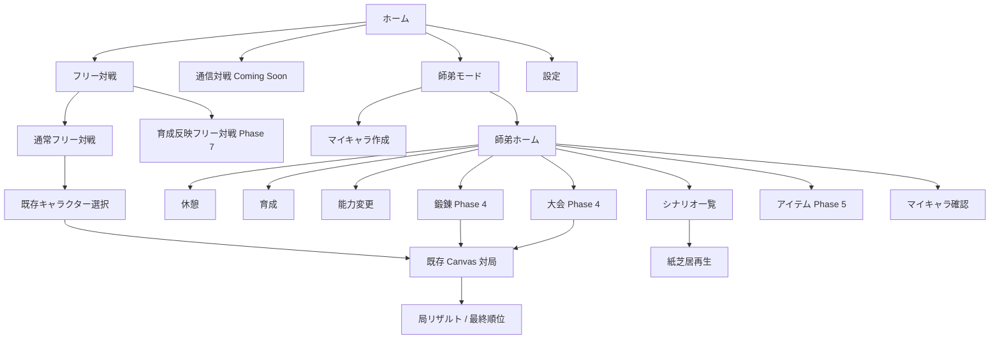

# 能力系麻雀ゲーム 大型アップデート仕様書

更新日: 2026-06-02  
ステータス: 実装前仕様案  
対象プロジェクト: HTML + CSS + JavaScript + Canvas 製「麻雀RPG プロトタイプ」

---

## 1. 本仕様書の目的

本仕様書は、現行の能力系麻雀ゲームを、
単発 CPU 対局を楽しむプロトタイプから、
自分だけの雀士を育成し、師匠キャラクターとの関係性を積み上げる継続型ゲームへ拡張するための基準文書である。

大型アップデートは一括実装しない。
既存のフリー対戦を壊さず、各 Phase の終了時点で動作確認できる状態を保ちながら段階導入する。

本仕様書では、次を定義する。

- 現行実装の前提
- 大型アップデート後のモード構成
- Canvas と HTML/CSS の責務分離
- MVP の範囲
- マイキャラ、師匠、育成、能力変更、シナリオ、大会、アイテムの仕様
- localStorage 先行と Supabase 移行の方針
- マスタデータとユーザーデータ
- 対局エンジンとの接続方法
- 実装順序、変更対象、完了条件
- 未決事項と初期推奨値

---

## 2. 現行実装の前提

### 2.1 現在の構成

現行プロジェクトは、依存パッケージなしで動作する静的 Web アプリである。

```text
/
  index.html
  styles.css
  server.mjs
  package.json
  README.md
  graphic/
  sound/
  src/
    main.js
    core/
      game.js
      events.js
      tiles.js
      wall.js
      meld.js
      rules/
    abilities/
      ability.js
      hooks.js
      registry.js
      builtins/
    characters/
      characters.js
    data/
      characterMaster.js
      abilityMaster.js
    ai/
      simpleAI.js
    ui/
      canvasRenderer.js
      assets.js
      settings.js
  test/
    smoke.mjs
    sanma.mjs
    rounds.mjs
    balance.mjs
```

### 2.2 現在の画面

現行 HTML には 2 つの主要画面がある。

| 画面 | DOM | 内容 |
| --- | --- | --- |
| キャラクター選択 | `#select-screen` | キャラ選択、四麻/三麻、東風/半荘、対局開始 |
| 対局 | `#game-screen` | Canvas 卓、アクションバー、ログ、演出、設定 |

対局画面内には次の HTML overlay がある。

- 鳴き演出
- ロン、ツモ演出
- 点数増減演出
- 能力カットイン
- 局リザルト
- 最終順位
- 音量設定

画面遷移はルーターを使わず、`src/main.js` が `hidden` クラスを切り替えている。

### 2.3 Canvas の現在の責務

`src/ui/canvasRenderer.js` は、状態変更を行わない純描画層である。

- 卓中央
- ドラ
- キャラクター名、アイコン、持ち点ゲージ
- 手牌、ツモ牌、牌裏
- 河
- 鳴き牌
- 危険牌ハイライト
- 手牌クリック判定
- ホバー時の待ち牌表示

この責務は大型アップデート後も維持する。

### 2.4 対局エンジンの現在の責務

`src/core/game.js` は UI 非依存の同期型エンジンである。

実装済み:

- 四人麻雀
- 三人麻雀
- 東風戦
- 半荘戦
- ツモ、打牌、ポン、チー、カン、リーチ、ロン
- 三麻の北抜き
- 山、王牌、ドラ、嶺上
- 和了、役、符、飜、点数
- 本場、供託、親流れ、流局テンパイ料、流し満貫
- トビ終了
- 最終順位

現行では `Player.points` が麻雀の持ち点であり、キャラクターの HP としても扱われている。

### 2.5 キャラクターと能力

`src/data/characterMaster.js` には 13 キャラクターが定義されている。
各キャラクターは、初期持ち点、画像、プロフィール、固有能力を持つ。

`src/data/abilityMaster.js` には 13 能力の表示定義があり、
実際の挙動は `src/abilities/builtins/` に分離されている。

能力システムは `src/abilities/hooks.js` と `src/abilities/registry.js` を使うフック方式である。

主なフック:

- `MODIFY_DRAW`
- `MODIFY_CALL_ELIGIBILITY`
- `MODIFY_SCORE`
- `MODIFY_POINT_DELTA`
- `PROVIDE_DANGER_INFO`
- `ON_HAND_START`
- `ON_TURN_START`
- `ON_DRAW`
- `ON_DISCARD`
- `ON_MELD`
- `ON_WIN`
- `ON_HAND_END`

### 2.6 特殊対応が必要な既存能力

能力の多くはフックだけで動作する。
ただし、次の能力は専用 UI またはエンジン補助を持つ。

| 能力 | 現在の特殊対応 |
| --- | --- |
| リコール・ディール | 河の牌選択 UI、`Game.recallSwap()` |
| 強制ツモ切り | 対象選択 UI、`Player.forcedTsumogiri` |
| 大博打 | 賭け金選択 UI、発動時の持ち点消費 |

育成用の能力候補へ追加する際は、単純な能力 ID 差し替えで済む能力と分けて扱う。

### 2.7 現在の保存

localStorage へ保存されるのは音量設定だけである。

```text
mahjong-rpg.audio
```

育成、所持ソウル、シナリオ既読、アイテム、戦績、認証、オンライン保存は未実装である。

### 2.8 現在のテスト

2026-06-02 時点で次を確認済み。

| コマンド | 結果 |
| --- | --- |
| `node test/smoke.mjs` | 成功。四麻 40 ゲーム自動対局 |
| `node test/sanma.mjs` | 成功。三麻 40 ゲーム自動対局 |
| `node test/rounds.mjs` | 成功。東風、半荘、連荘、流局、トビ終了 |

大型アップデート中も、この 3 テストを回帰確認として維持する。

---

## 3. 大型アップデートの設計方針

### 3.1 基本原則

1. 既存フリー対戦を壊さない。
2. 対局エンジンへ育成、報酬、保存、認証の責務を持たせない。
3. Canvas は麻雀卓と対局表現へ限定する。
4. ホーム、師弟、育成、紙芝居、アイテム、設定、ログインは HTML/CSS で作る。
5. マスタデータ駆動に寄せる。
6. 初期は localStorage で保存し、後から Supabase repository へ差し替える。
7. 画像はプリセット ID だけを保存する。
8. 通信対戦とカスタム画像アップロードは初期対象外にする。
9. 紙芝居は軽量 CSS animation に限定し、対局以外にも再利用可能にする。

### 3.2 既存コードを保護する範囲

初期 Phase では、次を大きく変更しない。

- `src/core/game.js` の局進行
- `src/core/rules/`
- `src/core/wall.js`
- `src/core/tiles.js`
- `src/ui/canvasRenderer.js`
- 既存能力ロジック
- `src/main.js` の対局中ループ

### 3.3 拡張時に分離する責務

`src/main.js` は 900 行超で、選択画面、対局起動、入力、CPU タイマー、演出、リザルトを持つ。
新しい HTML 画面を直接追加し続けない。

段階的に次を追加する。

```text
src/
  app/
    router.js
    appState.js
  screens/
  progression/
    profileRepository.js
    localProfileRepository.js
    progressionService.js
    rewardService.js
    matchResultAdapter.js
  scenario/
    scenarioService.js
    scenarioPlayer.js
  items/
  auth/
  data/
```

---

## 4. 更新後のモード構成

### 4.1 ホーム

ホームには次を置く。

- フリー対戦
- 通信対戦
- 師弟モード
- 設定

### 4.2 フリー対戦

#### 通常フリー対戦

初期から提供する。
現行のキャラクター選択と CPU 対局をそのまま再利用する。

- 育成結果を反映しない
- 既存キャラクターの固定性能を使う
- 既存キャラクターの固定性能はスキル Lv5 相当とする（フリー対戦は Lv5 が上限。Lv6〜10 の超越帯は育成反映でのみ到達する）
- 四麻、三麻を選択できる
- 東風戦、半荘戦を選択できる
- 報酬なし
- すぐに能力麻雀を遊ぶ入口

#### 育成反映フリー対戦

Phase 7 で追加する。

- マイキャラを使用する
- キャラ Lv、HP、能力種類、対応済みスキル Lv、装備を反映する
- 大会前の練習に使う
- 報酬は大会より少なくする

### 4.3 通信対戦

初期は Coming Soon 表示だけを作る。

将来候補:

- 育成あり PvE
- 育成制限あり PvP
- フラット PvP

通信対戦本体では、クライアントだけで山、手牌、結果、報酬を確定しない。

### 4.4 師弟モード

師弟モードは継続プレイの中心である。

最終的なメニュー:

- 師弟ホーム
- マイキャラ
- 休憩
- 育成
- 能力変更
- シナリオ
- 鍛錬
- 大会
- アイテム

初期は使える機能だけを表示し、
未実装メニューを大量に並べない。

---

### 4.5 師弟モード／覇道モード 設計詳細（肉付け版・確定）

本節は師弟モード／覇道モードの**設計意図の正典**である。
§10（ソウル・育成）、§11（休憩）、§13（鍛錬）、§14（大会）は本節の方針に従う。
Phase 構成（§20）は実装順序であり、本節と矛盾する場合は本節の意図を優先して調整する。

#### 4.5.1 コンセプト

**「失敗しないサクセス」**。
1 人の弟子を師匠とともに長く育て、小さな大会を勝ち抜いて “宝の大会” へ至る。
終わりはあるが負けはない。速く・強く・深く育てた者だけが上の評価へ届く。
サクセスの緊張感を、強制ではなく**任意のスコアアタック**へ変換する。

愛着 4 原理での位置づけ:

- 蓄積: 弟子 1 人の長い攻略 ＋ 周回をまたぐ「弟子見送り数」
- 固有性: 休憩 2 択を師匠が覚える／師匠別キャンペーンで道が違う／雀荘ごとの世界
- 双方向: 休憩内の 2 択
- 反転: クリア評価により「ただのクリア」が「自己ベスト挑戦」へ意味替えする

#### 4.5.2 メタ構造（周回をまたぐ層）

- 継続育成型・**失敗なし**。1 周 ＝ 1 人の弟子の長い攻略。
- クリア時に **日数 × 勝率 → クリア評価** を算出する。
  評価ランク: `満貫級 → 跳満級 → 倍満級 → 三倍満級 → 役満級 → ダブル役満級`
  **満貫級を下限**とし、のんびり進めても肯定感を必ず残す。
- 評価ランクが **別リソース（メタ通貨）の獲得量** に直結する。
- 大会外で HP が 0 になった場合は **強制休憩で数日ロス**（評価が下がるだけ。ゲームオーバーは無い）。
- 周回（新しい弟子の作成）で引き継ぐもの:
  - メタ通貨 → 新弟子の初期ボーナス
  - 過去に育てた弟子を保持
  - 解放要素を保持
  - **弟子見送り数**（プレイヤー生涯カウント。将来の称号・解放トリガーに使う）
- 別リソースの使い道:
  - 新弟子の初期ボーナス（確定）
  - 新師匠の解放（当面はモック）
  - 新雀荘・新大会の解放
  - コスメ（称号・フレーム・立ち絵差分）

#### 4.5.3 コアループ（毎日の層）

原則として**全コマンドが 1 日を消費**する（大会のみ複数日）。

| コマンド | 日 | HP | ソウル | 絆 | 効果 |
| --- | --- | --- | --- | --- | --- |
| 休憩（コミュ内包） | 1 | 大回復 | 小 | ++ | デイリー会話 ＋ 2 択（師匠が覚える） |
| 座学 | 1 | −小 | — | +微 | 読み（主）・守備（副）を伸ばす（安全・地味）※§4.6.1 |
| 鍛錬(CPU) | 1 | −中 | ++ | + | 火力（主）・速度（副）を伸ばす（ソウル稼ぎ）※§4.6.1 |
| 師匠と 2 人打ち | 1 | −中(手心) | + | +++ | メンタル（主）・読み（副）＋素が滲む（愛着の主戦場）※§4.6.1 |
| 雀荘巡り | 1〜 | 変動大 | +++変動 | + | ハイリスク高報酬／レア遭遇／雀荘個性 |
| 育成（ソウル消費） | 1 | — | 消費 | — | HP 最大値・スキル Lv・キャラ Lv |
| 能力変更 | 1 | — | 消費 | — | 能力種別変更（スキル Lv リセット） |
| 大会 | 複数 | runHp 管理 | 大 ＋ 別リソース | + | クリア評価に直結 |

- **コミュニケーションは休憩へ内包**する。休憩 ＝ HP 大回復 ＋ デイリー会話 ＋ 2 択。
  「回復する」が同時に「関係を深める」になる二重の意味を持たせる。
- やりくりの核: 稼ぐ日／育成に変える日／絆を積む日／回復する日の並べ方が、そのまま日数評価に効く。
  ハード制限を入れずにサクセスのトレーニング感を出す。
- 要追い込み: HP 満タン時の休憩は「会話だけ進めて回復ぶんを無駄にしない」見せ方にする。

#### 4.5.4 進行（大会・モブ・師匠キャンペーン層）

- **章の関門 ＝ シナリオ読了**。育成・大会・絆積みは「次 ep の解放条件（§12.5）を満たす手段」である。
  条件達成 → 次 ep が読める → **読了で次章**（モブ Lv 帯 UP・新雀荘／新大会オープン）。
- **モブ強度 ＝ 大会／雀荘ごとの `mobLvBand`(min-max)**。seed で個体 Lv を帯内決定する
  （既存 `mobMaster.js` の seed 決定論に乗せる）。
- **師匠別キャンペーン定義**（新マスタ `mentorCampaignMaster.js`）が、章ごとに
  「開く大会・雀荘・モブ Lv 帯・解放 ep・3 人目召集」を師匠ごとに記述する。
- **3 人目召集 ＝ 団体戦の解放**（既存 team battle mode を活用。シナリオの団体戦優勝と連動）。
  召集タイミングはキャンペーンの節目で指定する。

```js
// mentorCampaignMaster.js — 師匠ごとに 1 定義
{
  mentorId: "shiyue",
  chapters: [
    { id: "ch1",
      unlockScenario: { epId: "shiyue-ep01", cond: "always" },
      tournaments: ["t-rookie-01"], parlors: ["p-backstreet"],
      mobLvBand: { min: 1, max: 3 } },
    { id: "ch2",
      unlockScenario: { epId: "shiyue-ep02", cond: { tournament_won: "t-rookie-01" } },
      tournaments: ["t-amateur-01"], parlors: ["p-backstreet", "p-uptown"],
      mobLvBand: { min: 3, max: 5 }, callAlly: null },
    // … 終章: 宝の大会
  ],
}
```

```js
// 大会データ
{ id, tier: "初級|中級|上級|宝", matches: 3,
  mobLvBand: { min, max }, abilityDensity: 0.3,
  unlock: <条件>, reward: { soul, meta } }
```

#### 4.5.5 覇道モード

- 師弟編クリア後に到達する。ループはほぼ師弟モードと同じ。
- 差分①: **師匠も独自育成（二人三脚）**。師匠にも HP／スキル Lv があり、ソウル（または別リソース）で育てる。育成対象が 2 体になる。
- 差分②: **宝を 9 個集めるまでが目的**（終局構造は要詰め）。

#### 4.5.6 先送りした論点（次の肉付け候補）

1. 別リソースの名称（テーマ性）
2. 覇道の宝 9 個の構造（9 章一本道／9 周／1 キャンペーン内 9 個）
3. 座学／鍛錬が伸ばすスキル系統の具体マッピング
4. クリア評価式（日数 × 勝率の重み・各ランクのしきい値）
5. 団体戦の CPU 交代 AI（既存の宿題）
6. HP 満タン休憩の見せ方（4.5.3 の注記）

---

### 4.6 オートバトル／育成パラメータ（サクセス層）

師弟モードに**サクセス育成のステータス層**を足す。麻雀対局エンジンには一切反映せず（§3.1 を堅持）、
師弟モード内の**オートバトル**と**大会出場ゲート**にだけ効く専用ステータスとする。
プレイは 2 層になる:

| 層 | 戦力 | いつ | 体感 |
| --- | --- | --- | --- |
| オートバトル（RPG 風） | 育成パラメータ（本節） | 日常の試合・大会の道中 | サクッと・麻雀と違う感覚 |
| 本気対局（リアル麻雀） | スキル Lv ＋ 能力（§10.5） | 節目／プレイヤー宣言時 | じっくり・既存の麻雀 |

#### 4.6.1 育成パラメータ

オートバトル専用の数値。スキル Lv（本気対局用）とは別レイヤー。

| パラメータ | 連動コマンド | 役割 |
| --- | --- | --- |
| 火力（攻め） | 押す | 押し切って大きく取る |
| 守備（受け） | 引く | 放銃を抑え、損を減らす |
| 読み（判断） | 様子を見る | 情報・安全度・好機を見極める |
| 勝負勘（運・胆力） | 次ラスで！ | 一発逆転の博打手 |
| 速度（手作り） | （パッシブ） | 先制・手番有利 |
| メンタル（集中） | （パッシブ） | 劣勢でも崩れない・ブレ低減・大事な局面で粘る |

- 4 つは**オートバトルのコマンドに 1:1 対応**、2 つはパッシブ。
- 上げ方・上限・初期値は §25 同様にチューニング値として一箇所へ集約する。

**上げ方（確定）**: 6 パラメータは**活動コマンドが直接伸ばす**（サクセスの王道。ソウル購入ではない）。
1 活動につき **主 1 ＋ 副 1**（どの日も総合が少し伸びる）。
スキル Lv（本気対局用）は別軸で、**育成（ソウル消費）で買う**（§10.5）。

| コマンド | 主（大きく伸びる） | 副（小さく伸びる） | 備考 |
| --- | --- | --- | --- |
| 座学 | 読み | 守備 | 安全・地味 |
| 鍛錬(CPU) | 火力 | 速度 | ＋ソウル稼ぎ |
| 二人打ち | メンタル | 読み（師匠の指導） | ＋絆大 |
| 雀荘巡り | 勝負勘 | ランダム 1 種 | ハイリスク＝伸び変動大 |
| 休憩 | —（HP 回復＋絆のみ） | — | 回復枠 |
| 育成（ソウル消費） | HP 最大／**スキル Lv**／キャラ Lv | — | 本気対局＆耐久を「買う」 |

> 守備・速度は副でのみ伸びる（＝専門性のある伸ばしにくいステ）。全 6 種に主トレーナーを
> 用意したい場合は活動コマンドの追加（座禅＝メンタル 等）で将来拡張する。
> これに伴い §4.5.3 の活動説明は「スキル Lv 経験」から本パラメータへ読み替える。
> 雀荘巡りの副「ランダム 1 種」は、その**雀荘の個性で偏った抽選**（攻めの雀荘＝火力寄り／
> 玄人の雀荘＝読み寄り 等）。各雀荘がパラメータ抽選の重みを持つ。

#### 4.6.2 相手との総合評価（6 段階）

自分のパラメータ総合と相手（モブ）のそれを比べ、6 段階で表示する。
この 1 指標が「オート勝率・本気宣言の動機・大会ゲート」の 3 役を兼ねる。

**算出（初期値・チューニング前提）**:
- 自総合 ＝ 6 パラメータの合計（パッシブ含む・等重み。将来は重み付け可）。
- 相手総合 ＝ `mobLvBand`（§4.5.4）から算出（Lv → パラメータ合計の写像）。
- 比率 `r = 自総合 / 相手総合` を 6 段階へ写像する。

| 評価 | r（暫定しきい値） | オートでの体感 |
| --- | --- | --- |
| 優勢 | ≥ 1.25 | ほぼ勝てる |
| やや優勢 | 1.10 – 1.25 | 有利 |
| 拮抗 | 0.92 – 1.10 | 五分・乱数次第 |
| やや劣勢 | 0.78 – 0.92 | 削られがち → 本気宣言の検討ライン |
| 劣勢 | 0.62 – 0.78 | かなり苦しい |
| 大劣勢 | < 0.62 | **100% 負け＝大会は門前払い** |

- **やや劣勢以下**: オートバトルで削られる／負ける可能性が出る → **本気宣言**の動機になる。
- **大劣勢**: 100% 負け。大会では実質**門前払い**（育成で評価を押し上げてから挑む）。

#### 4.6.3 オートバトル（局単位ターン制）

- **1 試合 ＝ 東風 4 局**（＝コマンドを 4 回選ぶ）。
- 各局：あなたがコマンド選択 → 1 局を進め、**誰かのロン／ツモで点棒のやりとり**が起きる。
- **HP（点棒）は局ごとに増減（点棒の奪い合い）**。自分の和了＝点を獲得（HP 増）、放銃／被ツモ＝点を失う（HP 減）。
  各局の和了は **役・翻・点数** を持ち、まず中央に表示してから HP 増減演出を流す。
- **1 試合終了ごとに一定回復**（自動。`休憩`コマンドとは別物で、大会内でも入る）。
  ＝連戦は「削られる → 少し戻る」のリズム。回復量はチューニング値。
- HP 0 で敗退。`runHp`（§14.3）を大会全体で持ち越す。勝敗は**クリア評価（日数×勝率, §4.5.2）**の勝率に乗る。

> 演出：中央に**卓を囲む 4 人**（あなた＝弟子アイコン／相手＝モブのシルエット）。毎局、和了が出ると
> **中央の結果カードに「役・翻／点数／獲得 or 放銃」** を見せ、その後に既存フリー対戦由来の
> **HP やりとり（点棒移動）をデフォルメ再生**する。勝者の席をハイライト。

コマンドの効き（係数は §25 同様チューニング値。「取れたら」＝自分の和了で点を獲得）:

| コマンド | 局を取れたら | 取れなければ | 使いどころ |
| --- | --- | --- | --- |
| 押す（火力） | 高めの点を獲得（HP 増） | 大きく失点（放銃） | 優勢・火力高 |
| 引く（守備） | 取れても獲得は小 | 守備で大幅軽減した小失点 | 劣勢・守りたい |
| 様子を見る（読み） | 小さく獲得＋次手の精度↑ | 小失点 | 立て直し |
| 次ラスで！（勝負勘） | 特大の点を獲得 | 致命的失点 | ラス局・一発逆転 |

- **速度**: 先制（毎局わずかに局を取りやすい・同点時に勝つ）。
- **メンタル**: 乱数の振れ幅を圧縮（事故減・優勢を守る）＋劣勢で粘り。
- **読み合い（確定）**: 読みが高いほど**次局の相手スタンスが事前に見える**（段階開示）＝押す／引く／様子見の択が機能する。
  読みが低いと見えず確率任せになる。これがオートを「単なる確率ガチャ」でなく**読み合いの択ゲー**にする芯。

#### 4.6.4 本気対局への切り替え

- **節目（大会の決勝・ボス戦）は強制的にリアル麻雀**。
- 道中はプレイヤーが**「本気」を宣言**して、いつでもリアル麻雀へ持ち込める（やや劣勢以下を腕で覆す逃げ道）。
  本気対局では `スキル Lv` ＋ 能力が効く＝パラメータ不足を麻雀の実力でねじ伏せられる。
- **本気勝利ボーナス（確定）**: 勝つと**ソウル増量（オートの 1.5〜2 倍）＋パラメータ経験**。
  **負けても通常の HP 減のみ**（追加ペナルティなし＝失敗なし路線）。倍率は要チューニング。

#### 4.6.5 大会出場ゲート・継続・撤退

- **出場ゲート**: 各大会に必要ライン（評価が**大劣勢なら門前払い＝出ても 100% 負け**）。
  育成でラインを満たしてから挑む＝サクセスの王道動線。`mobLvBand`（§4.5.4）と評価式で算出する。
- **構成**: 大会／雀荘は**全 N 試合**。1 試合終わるごとに「もう 1 試合？」を選べる。
- **撤退（確定）**: いつでも撤退できる。ただし**大会を撤退すると「勝ち抜き」扱いにならない**
  （大会クリア報酬・解放ゲート `tournament_won`（§12.5）は付かない）。雀荘はその時点までの報酬は残る。
- **完走**: N 試合を HP > 0 で勝ち抜くと大会クリア。HP 0 で敗退。
- これは §14.2／§14.3 の初級大会（固定 3 戦・runHp）を、撤退可・試合間回復ありに**更新**する。

#### 4.6.6 残りはチューニング値のみ

仕様（対応表 §4.6.1／評価式 §4.6.2／オートバトル §4.6.3／本気ボーナス §4.6.4／雀荘抽選 §4.6.1）は確定。
実装前に決める**数値**だけが残る（§25 同様、単一の出どころへ集約）:

- 各コマンドの勝率係数・delta の大小、速度/メンタルの効き量
- 評価 6 段階の `r` しきい値、パラメータ → 評価 の重み
- 本気勝利ボーナス倍率（1.5〜2 倍の確定値）、付与パラメータ経験量
- 各雀荘のパラメータ抽選重み

**オート経済の再調整（HP・翻・敵強度が噛み合う 1 セット）**:
- ✅ **初期 HP（点棒）を低く（Lv1=5,500）**＋ HP 成長カーブを小さく（`avatarLevelMaster`/`avatarFactory`）。
- ✅ **火力で和了の翻の幅が広がる**: 低火力＝ほぼ 1〜2 翻、火力が伸びるほど満貫・跳満まで（`rollHand` を火力連動に）。
- ✅ **序盤の雀荘の相手を激弱に**: `paramsFromLv` を新スケール（lv0≈激弱）＋雀荘ごとに**敵 HP（`oppHpMax`）**を持たせ、
  相手が 0 になると**トビ終了（こちらの勝ち）**。楽勝＝敵 HP 2,600＝**リャンハンで飛ぶ**を実機確認。
- 未: シナリオ進捗に応じた**連戦数・敵ステ・敵 HP・ソウルの本スケール**（現状 `scenarioProgressLevel`=0 固定の仮値）。
- **二人打ち＝師匠（弟子が選んだ師匠）とのタイマン**で、オートではなく専用フロー。**オート/本気（手動）を選べる**が、初期はステ差が大きく**オートだとほぼ負ける**。**負けても「どれだけ迫れたか」で上昇値が変わる**（惜敗ほど伸びる）。二人麻雀モード（[[two-player-mahjong]] 相当）と接続。
  - **師匠ごとに打ち筋が出る（採用）**: 師匠の role（攻め/守り/博打 等）でタイマンの相手 param 配分・コマンド傾向を変え、「誰に師事したか」がタイマンの手触りに効く＝愛着の固有性。詩玥＝攻め寄り／ビビ＝守り寄り／賭羽ルイナ＝博打寄り、を起点に。

#### 4.6.7 ステータス可視化と計算式（実装版・整理）

**「何があり／何で上げ／何に直結するか」の一望**（マイキャラ画面に表示）。正典の分担:
意味（名前・上げ方・効果・ランク）＝ `src/autobattle/statSystem.js`／数値（係数・しきい値）＝ `src/autobattle/autoBattle.js` の `CFG`。

| ステータス | 連動 | 上げ方（主/副） | オートへの直結 |
| --- | --- | --- | --- |
| 火力 | 押す | 鍛錬(主)・雀荘巡り(運) | 「押す」の局取り力＋獲得点 |
| 守備 | 引く | 座学(副)・雀荘巡り(運) | 「引く」時の被害軽減（放銃を抑える） |
| 読み | 様子を見る | 座学(主)・二人打ち(副)・雀荘巡り(運) | 様子見の立て直し＋**相手スタンス事前開示**（読み合い） |
| 勝負勘 | 能力発動 | 雀荘巡り(主) | 能力発動／博打手の一撃（高打点・一発） |
| 速度 | （パッシブ） | 鍛錬(副)・雀荘巡り(運) | 先制（局取り率＋）＋手が高くなりやすい |
| メンタル | （パッシブ） | 二人打ち(主)・雀荘巡り(運) | 乱数の振れ幅圧縮（事故減・優勢維持） |

**ランク（サクセス育成風 G〜S・値 0–99 を写像）**: S≥90 / A≥77 / B≥64 / C≥51 / D≥38 / E≥25 / F≥13 / G≥0。
マイキャラ画面で各ステの「Lv（実数値）＋ランク色バッジ＋上げ方＋効果」を表示する。

**計算式（実装値・すべて `CFG` でチューニング）**:
- 局取り確率 `prob = baseWin + k·(self[selfP] − opp[oppP])/diffScale + speed·speedWinBonus + watchStack·watchBonus (+ ability ? abilityWinBonus)`、`clamp(0.05, 0.95)`。能力発動時は下限 `abilityWinFloor` を保証。
  - コマンド係数 `cmd`: 押す{self:火力,opp:守備,k:1.0} / 引く{守備,火力,0.5} / 様子見{読み,読み,0.6} / 勝負勘(能力)系{勝負勘,守備,1.2}。
- 和了の打点 `rollHand`: `t = (火力+勝負勘)/2/99·0.5 + 攻撃性·0.4 + rng·0.5 (+ ability ? abilityHanBoost)` を翻テーブルへ写像。
- 点棒移動の種別抽選: 自分和了→ツモ(全員払い) `selfTsumoRate` / 残りロン。相手和了→ツモ `oppTsumoRate` / 自分へロン `oppRonYouRate` / 他家へロン（残り＝自分は難を逃れる）。
- 自分が払う額の軽減: `引く`で `1 − 守備/160`（下限0.4）、メンタルで乱数振れ `0.25 − mental·mentalVarReduce`（下限0.05）を圧縮。
- 読み合い開示: `読み − 相手読み ≥ revealMargin` で次局の相手スタンスを開示。
- 総合評価（§4.6.2）: `r = Σ自パラメータ / Σ相手パラメータ` を 6 段階へ。

**日次ループ＆調子（実装版）**: **1 日 ＝ 3 行動**（休憩・座学・鍛錬・二人打ち・雀荘巡りが各 1 行動。
3 回で日が進む。育成購入/能力変更/シナリオは行動を消費しない）。日の始まりに**バナー**で「〇日目」と
**師匠・弟子の調子**（**絶不調 / 不調 / 普通 / 好調 / 絶好調** の 5 段階・普通に寄せて抽選）を提示する。

各訓練は **大成功 / 成功 / 無難 / 失敗** を引き、伸び量に倍率（大成功 ×2.2 / 成功 ×1.5 / 無難 ×1.0 /
失敗 ×0.34、主は最低 +1＝失敗なし路線）。引きの良さ ＝ **メンタル（恒常）と当日の調子（変動）の合算**
（`f = 0.5·mental/99 + 0.5·condition/4`）。メンタルが高いほど無難・失敗が減り成功・大成功へ寄る
（対局オートと同じ「ブレを抑える」性格）。**失敗で調子↓ / 大成功で調子↑ / 休憩で調子↑（1 段階・上限 絶好調）**。結果に応じて**師匠が一言返す**（双方向の愛着フック）。

**調子のオートへの波及（軽め）**: 当日の調子 bias（−2…＋2）が局取り確率に `±bias·0.02` だけ乗る
（絶好調の日は対局も少し乗る）。オートは基本ステで決まる思想（§3.1）を崩さない範囲の味付け。

集約先: 日次・調子 ＝ `ACTIONS_PER_DAY` / `CONDITIONS` / `ensureDay` / `dayInfo` / `endAction`、
訓練結果 ＝ `TRAIN_OUTCOMES` / `rollTrainOutcome`（いずれも progressionService）。オート係数は `CFG.conditionWinStep`。

#### 4.6.8 雀荘巡り（候補選択・難易度・スケーリング）

**実装済み（選択レイヤー）**: 日替わり 3 候補（決定論：`parlorMaster.rollDailyParlors`／重み付き・レア大会中）→
候補ボタンに種別＋連戦数＋ソウル目安→選ぶと既存オートを連戦（`maxMatches`）→完走で「雀荘を後にする」→
勝ち抜き数 × 種別でソウル付与＋その雀荘をグレーアウト＋1 行動消費（`parlorState`/`visitParlor`、日替わりで `parlorsDone` リセット）。
**未実装（経済再調整バッチ）**: シナリオ進捗での連戦数・敵ステ・ソウルの本スケール、敵 HP、大会本体（多回戦化）、雀荘での param 経験有無。

雀荘巡り（1 行動）は「**その日の候補から雀荘を 1 つ選んでオートで打ちに行く**」サブ選択にする。

- **日替わり候補**: 雀荘巡りを選ぶと、その日の**候補が 3 種類ほどランダム提示**される。
  1 つ挑戦するとその雀荘は**グレーアウト**（その日は再挑戦不可）。**日が変わると候補をシャッフル**
  （`dayCount` をシードに決定論抽選でも可）。
  - **各候補ボタンに「連戦数（何戦するか）」を表示**する（例：「拮抗気味・3 戦」）。挑戦前に
    難易度と分量が分かるように。連戦数は下記スケーリング（種別 × シナリオ進捗）で決まる。
- **雀荘の種類**（いずれも「フリー対戦をやっている雀荘」＝中身は §4.6.3 のオートバトル）。出現は重み付き抽選:
  | 種類 | 出現率 | 体感 |
  | --- | --- | --- |
  | 楽勝寄り | 高 | 安定ソウル稼ぎ |
  | 拮抗気味 | 中 | 五分の勝負 |
  | チャレンジ | 低 | 高難度・高報酬 |
  | **大会中の雀荘** | チャレンジと同程度に低い（レア枠） | 特別戦。シナリオが進むほどトーナメントが大きくなる |
- **スケーリング**: 雀荘の**連戦数・敵ステ（oppLv／敵 HP）**は現在の**シナリオ進捗**に応じて上がる。
  **獲得ソウルは難易度（種別 × 進捗）に応じて増える**（楽勝＜拮抗＜チャレンジ＜大会中）。
- **大会中の雀荘**: シナリオが進むと**トーナメントが多回戦化**していく。※大会本体は未実装なので、
  当面は「開発中」表示で可（導線とレア出現だけ先に成立させてよい）。
- 中身は既存 autobattle（§4.6.3）を流用（oppLv／連戦数／敵 HP を「種別 × 進捗」から算出）。
  勝敗・勝ち抜き数に応じてソウル付与（§4.6.4 の本気ボーナスとは別の通常報酬）。
- **未決（実装時に確定）**: 雀荘で勝ったときに **6 パラメータ経験も入れるか**（§4.6.1 で 雀荘巡り＝勝負勘主・運の副）
  ／ソウルのみにするか。連戦数・敵ステ・ソウルの具体カーブ。出現重みの具体値。

#### 4.6.9 本気対局と対局起動 DTO（Phase 4A・仕様確定／未実装）

**用語の整理（重要）**: 当初 §20 Phase 4A の「鍛錬＝実対局を起動して報酬」は、§4.6 を先に作った今は
**「本気対局」** に読み替える（「鍛錬」は既に抽象育成コマンドとして実装済み）。
**二人麻雀（futari）はエンジン＋フリー対戦導線まで実装済み**（少牌80枚＝萬子+筒子2-8抜き／鳴きは暗槓のみ／
専用 HP ボード／`voiceSet:"shugyo"` 配線あり・人数選択「2人」で到達可能）。＝**師匠タイマンはこの上に乗せるだけ**。

##### A. 対局起動 DTO（実麻雀エンジン ⇄ 師弟モードの橋）
- `launchHonestMatch(config)` が既存 `beginGame`（全対局共通入口）をラップする。**フリー対戦は不変**（別入口）。
- **MatchLaunchConfig**: `mode:"honest"` ／ `seated`(弟子＋相手) ／ `rules{ rounds(東風/半荘), players(2|3|4), tableMode }`
  ／ `startPoints`(runHp 持ち越し or 固定) ／ `voiceSet`(例 `"shugyo"`) ／ `returnTo`("mentor-home"|"tournament-run") ／ `reward`。
  弟子は `skillTemplate → runtimeAbility` を投入（本気＝能力が効く §4.6.4）。
- **MatchResult**（終了時 `matchResultAdapter` が回収）: `placement` / `finalPoints`(残点) / `agariCount` / `houjuuCount`
  / `maxHan`(最高打点) / `won`。反映＝残点→`runHp`/`avatarHpCurrent`、着順→クリア評価の勝率(§4.5.2)、和了数・打点→param 経験、ソウル付与。
- 追加候補: `src/progression/matchResultAdapter.js` ／ `src/progression/honestMatch.js`（起動ラッパ）。

##### B1. 本気対局（4人・モブ）— 橋の最短実証
- 既存4人エンジンを honest 起動。相手＝モブ（`mobLvBand` の lv 帯）。報酬＝§4.6.4（勝利でソウル 1.5〜2 倍＋param 経験／**負けても通常 HP 減のみ**）。
- 導線は当面デバッグ or「腕試し（本気）」。後に C（大会）の決勝で再利用。

##### B2. 師匠タイマン（二人打ち＝本気）【実装済】
- 二人打ちタイルは**師匠との二人麻雀タイマン**になる（東南戦・futari・実装済エンジン／`voiceSet:"shugyo"`／持ち点は両者 25,000）。
- 開始時に **「オートで打つ / 本気で打つ」** を選ぶ＝**同じ一局を AI 自動打ち / 自分で手動**のどちらで打つか
  （既存の autoPlay＝人間席を AI に委ねる機能を流用。対局中トグルで切替も可）。
- **惜敗で伸び**＝`applyDuoResult` が残点（`finalPoints/25000` の closeness）でメンタル(主)・読み(副)の経験を段階化（完敗でも最低 +1）。勝てば調子↑＋ソウル。1 行動消費。
- TODO: 師匠ごとの打ち筋差（現状は師匠の素の能力／AI のまま）、師匠側の対局中ボイス（現状 `shugyo` は弟子=詩玥が打ち手のときのセット）。

##### 決定値（チューニング・実装時に確定）
- 持ち点: 単発の本気/タイマン＝**固定 25,000**（勝敗・点差を見る）／大会道中(C)＝**runHp 持ち越し**。
- param 経験カーブ: 和了数・最高打点・着順差から算出（C/D 実装時に微調整）。
- 本気勝利ボーナス倍率: 1.5〜2 倍（§4.6.4・要確定）。

##### 完了条件
- 師弟モードから本気対局（4人）を起動 → 対局 → 結果が育成へ反映され戻る。
- 二人打ちで「本気」＝二人麻雀 vs 師匠が遊べ、結果（惜敗の伸び含む）が反映される。
- フリー対戦は不変。

> ※ 本節は §20 Phase 4A/4B の「鍛錬／対局起動」部分を更新（上書き）する。

#### 4.6.10 初級大会とクリア評価（Phase 4B・実装版）

**九大至宝＝9 大会の定義（`tournamentMaster.TREASURE_TOURNAMENTS`）**: world.md §11 の 9 宝を `{ id, name, treasure{name,reading,baseYaku,symbol}, format, tier }` で定義。
**形式** `format`: `solo4`(個人四麻) / `solo3`(個人三麻) / `pair`(ペア2人) / `team`(団体3人) / `final`(無双国書＝会場でキャラ別に人数確定)。
**ティア** `tier`: 1 登竜門級 / 2 役満級 / 3 神域級。**敵の強さはマスタに持たない**＝キャラごとに挑戦順が違うので、
ティア既定値（`TOURNAMENT_TIER`：節数/ウマ/報酬/既定 oppLv）× **キャラ進捗の oppLv** を `tournamentRunConfig(id,{oppLv})` で実行時に合成する。
順序は **無双国書＝全キャラ最終で固定**、ティアは基本 T1→T2→T3（同ティア内はキャラ自由）。優勝で `records.treasures` に宝 id を記録。
※どのキャラがどの順で挑むか（キャンペーン）と相手 Lv の進捗カーブは別途（mentorCampaignMaster）。現状 CUP は詩玥編の最初＝**門前開鍵（solo4）**を起動。pair/team/solo3/final の大会ランは未対応（「準備中」表示）。

**宝の大会＝M リーグ制（全手動・実装版）**（ホーム CUP「宝への道」から）。`tournamentRunConfig`（門前開鍵＝3 節）。
- **節＝半荘**（東南戦・25000 持ち点）。全手動の実麻雀（`launchHonestMatch` を毎節・4人）。**ライバルは大会通して固定**（同じ顔ぶれと累積で競る）。
- **出場ゲート**：相手評価（§4.6.2）が **大劣勢なら門前払い**（`tournamentGate`）。
- **採点**：各節 **素点((最終−25000)/1000)＋順位点ウマ（+50/+10/△10/△30）**＝その節のポイント（`leaguePoints`）。**節をまたいで累積**。
- **順位表演出（ヒリヒリ）**：各節後に**累積ポイントの順位表**（4 者・この節の増減・弟子ハイライト・カウントアップ）を提示し、**次の節／退く**を選ぶ。
- **クリア（D）**：全節終了後の**最終累積順位**で評価（`applyLeagueResult`）。順位→ **評価ランク**（1位 役満級〜4位 満貫級／満貫級が下限・§4.5.2）＋**継承（`wallet.meta`）＋ソウル**。
  **最終1位＝優勝**で **`records.tournamentsWon++`**（＝シナリオ `tournament_won` 解放）。**失敗なし**（トビ終了はあるが大会脱落せず全節打ち切り。持ち点は節ごと 25000 で持ち越さない）。
- ※**雀荘巡りの「大会中の雀荘」はオート（autobattle）のまま**でよい（手触りの軽い枠）。

**未実装（今後）**: **ペア戦・団体戦の大会化（同じ M リーグ制で）**、大会の**複数日消費**（§4.5.3）、
**周回クリア評価**（§4.5.2 の日数×勝率→引退/見送り→継承）の本実装、複数リーグ・`mobLvBand` 連動・しきい値チューニング・順位点の自動/手動演出の作り込み。

---

## 5. MVP の再定義

大型構想を一度に実装しない。
初期 MVP は 3 段階に分ける。

### 5.1 MVP-A: 既存対局を守る入口

- ホーム
- フリー対戦メニュー
- 通常フリー対戦
- 通信対戦 Coming Soon
- 設定

### 5.2 MVP-B: ローカル師弟モード

- 1 ユーザー 1 マイキャラ
- プリセット式のアイコン、立ち絵、背景、フレーム
- 師匠選択
- 初期能力種類選択
- ソウル
- キャラ Lv
- HP 成長
- スキル Lv 成長
- 能力変更
- 能力変更時のスキル Lv リセット
- 師弟ホーム
- 休憩
- localStorage 保存

### 5.3 MVP-C: 師匠との関係性

- シナリオ一覧
- 紙芝居再生
- 既読保存
- 再閲覧
- 初回読了報酬
- 立ち絵ジャンプ
- 立ち絵シェイク
- 画面フラッシュ
- 画面シェイク
- フェードイン
- フェードアウト

MVP-C 完了時点で、
「師匠を選ぶ、日々休憩する、育成する、能力を変える、会話を見る」
という師弟モードの芯を確認できる。

---

## 6. 初期対象外

次は初期 MVP に含めない。

- 通信対戦本体
- カスタム画像アップロード
- 他プレイヤーへのカスタム画像表示
- ランキング
- フレンド
- ギルド、道場
- ショップ
- プレミアムパス
- アイテム合成
- 複数師匠
- 師匠変更
- 能力継承
- 複数マイキャラ
- ボイス
- 紙芝居の複雑なタイムライン
- 複数キャラ同時演出
- シナリオ選択肢
- バックログ
- オート再生
- スキップ
- 本格リアルタイム対戦サーバー

---

## 7. 画面構成

### 7.1 画面遷移



### 7.2 HTML 画面

| 画面 ID 案 | 画面 | 導入 Phase | 責務 |
| --- | --- | --- | --- |
| `home` | ホーム | 1 | 主要モード入口 |
| `free-battle` | フリー対戦 | 1 | 通常フリー、将来の育成反映フリー |
| `online-coming-soon` | 通信対戦 | 1 | 未実装案内 |
| `settings` | 設定 | 1 | 音量設定 |
| `avatar-create` | マイキャラ作成 | 2A | 名前、プロフィール、プリセット、師匠、能力 |
| `avatar-detail` | マイキャラ確認 | 2A | 現在値、見た目、師匠、能力 |
| `mentor-home` | 師弟ホーム | 2B | 日次導線、師匠、ソウル |
| `rest` | 休憩 | 2B | 回復、会話、日次報酬 |
| `growth` | 育成 | 2B | HP、スキル Lv |
| `ability-change` | 能力変更 | 2B | 候補、コスト、リセット確認 |
| `scenario-list` | シナリオ一覧 | 3 | 解放、未読、報酬 |
| `scenario-player` | 紙芝居 | 3 | 会話、演出、進行 |
| `training-list` | 鍛錬一覧 | 4A | 鍛錬選択 |
| `training-result` | 鍛錬リザルト | 4A | 報酬 |
| `tournament-list` | 大会一覧 | 4B | 大会選択 |
| `tournament-run` | 大会進行 | 4B | `runHp`、戦数、再開 |
| `tournament-result` | 大会リザルト | 4B | 完走、敗退、報酬 |
| `item-list` | アイテム | 5 | 所持、装備、制限 |
| `login` | ログイン | 6 | Google 認証 |
| `account` | アカウント | 6 | 同期状態、ログアウト |
| `growth-free-setup` | 育成反映フリー | 7 | マイキャラ、装備、ルール |

### 7.3 対局画面

既存 `#game-screen` を維持する。

Canvas に残す:

- 麻雀卓
- 牌
- 河
- 鳴き牌
- 卓内持ち点
- 卓内キャラクター
- 危険牌表示

HTML overlay に残す:

- アクションバー
- 能力ボタン
- 鳴きボタン
- 能力カットイン
- ロン、ツモ演出
- 局リザルト
- 最終順位
- 将来の限定的な対局中アイテム

Canvas に追加しない:

- ホーム
- ソウル
- 育成
- 能力変更
- アイテム一覧
- シナリオ一覧
- 紙芝居本文
- 大会一覧
- アカウント

### 7.4 師弟ホーム

初期構成:

```text
[ソウル]                               [設定]

                 師匠立ち絵
              「今日はどうする？」

[休憩] [育成] [能力変更]
[シナリオ] [マイキャラ]
```

Phase 4 以降:

```text
[鍛錬] [大会] [アイテム]
```

---

## 8. マイキャラ仕様

### 8.1 基本仕様

初期 MVP では、1 ユーザーにつき 1 マイキャラだけを作成できる。

設定項目:

- キャラクター名
- プロフィール文
- アイコン
- 立ち絵
- 背景
- フレーム
- 師匠キャラクター
- 初期能力種類

将来追加:

- 称号プレート
- 師匠バッジ
- 装飾エフェクト
- マイキャラ追加枠

### 8.2 画像

初期はプリセット選択式とする。
自由アップロードは行わない。

保存するのは ID だけとする。

```text
icon
standing
background
frame
titlePlate
mentorBadge
effect
```

画像本体は静的ファイルとして配信する。

---

## 9. 師匠仕様

### 9.1 基本仕様

既存キャラクターを師匠候補として使う。

師匠の役割:

- 能力候補の基準
- 育成メニューの案内役
- 休憩会話
- シナリオ相手
- レベルアップ演出
- 能力変更演出
- 絆 Lv の対象

### 9.2 師匠変更

初期対象外とする。
能力種類を変更しても、師匠は変わらない。

### 9.3 初期候補数

初期実装では 13 キャラ全員へ同時対応しない。

推奨:

- 初期師匠 3 人
- 攻撃系 1 人
- 守備系 1 人
- ギャンブル系 1 人

理由:

- 能力候補とシナリオの品質を確保しやすい
- 初期データ量を抑えられる
- 師匠追加をアップデート要素にできる

---

## 10. ソウル、育成、能力変更

### 10.1 ソウル

ソウルは育成用通貨である。

初期入手元:

- 初回作成ボーナス
- 休憩
- シナリオ初回読了

Phase 4 以降:

- 鍛錬
- 大会

将来:

- デイリーミッション
- ウィークリーミッション
- ログインボーナス
- 実績

### 10.2 キャラ Lv

初期はソウルを消費してキャラ Lv を上げる。

初期 MVP では、複雑なステータスポイント割り振りを行わない。

推奨:

- HP 強化を個別購入
- スキル Lv 強化を個別購入
- キャラ Lv は節目解放と成長段階の表示に使う

将来:

- ステータスポイント
- アイテムスロット
- 絆補正

### 10.3 HP の再定義

現行の `Player.points` と大会用 HP を分離する。

| 用語 | 意味 | 使用場所 |
| --- | --- | --- |
| `startingPoints` | 既存キャラの対局開始持ち点 | 通常フリー対戦 |
| `avatarHpMax` | 育成したマイキャラの最大耐久 HP | 師弟モード、大会 |
| `avatarHpCurrent` | 休憩で回復するマイキャラの現在耐久 HP | 師弟モード |
| `runHp` | 大会中に持ち越す現在 HP | 大会ラン |

初級大会では、試合終了時に対局結果を `runHp` ダメージへ変換する。
局中リアルタイム HP 連動は初期対象外とする。

大会開始時は `avatarHpCurrent` を `runHp` へコピーする。
大会のクリア、敗退、離脱時は、残った `runHp` を `avatarHpCurrent` へ反映する。
大会進行中は休憩で `runHp` を直接回復できない。

### 10.4 能力種類

マイキャラが選ぶ能力種類は、既存能力を直接複製せず、
育成用 `SkillTemplateMaster` から選ぶ。

```text
SkillTemplateMaster
  -> runtimeAbilityId
  -> mentorCharacterIds
  -> familyId
  -> rarity
  -> levelTableId
  -> integrationTier
```

### 10.5 スキル Lv

スキル Lv 上昇で変化させられる要素:

- 発動回数
- 効果量
- コスト
- クールダウン
- 条件緩和
- 派生効果

ただし、初期はすべての能力へ数値差分を実装しない。

初期方針:

- スキル Lv は保存、表示、育成できる
- Lv 差分は対応済みテンプレートだけ反映する
- 未対応テンプレートは説明解放または使用回数差分だけにする

#### スキル Lv の範囲と帯

スキル Lv は **Lv1〜Lv10**。Lv5 と Lv6 の間で性質の異なる 2 帯に分ける。

| 帯 | スキル Lv | 到達手段 | 位置づけ |
| --- | --- | --- | --- |
| 基準帯 | 1〜5 | 通常育成・フリー対戦の固定値 | フリー対戦／師匠の標準性能。Lv5＝完成基準 |
| 超越帯 | 6〜10 | **育成反映でのみ到達** | フリー対戦には存在しない強さ。育てたマイキャラ専用 |

#### スキル Lv の基準レベル

スキル Lv には、文脈ごとの基準値を定める。

| 文脈 | スキル Lv | 用途 |
| --- | --- | --- |
| フリー対戦の既存キャラクター | 5 | 通常フリー対戦の標準性能（基準帯の上限） |
| 師匠の初期スキル Lv | 5 | 育成の到達目標、対戦相手としての基準 |
| 育成開始時のマイキャラ | 1 | 能力習得時・能力変更直後の初期値 |
| 育成反映の上限 | 10 | 育成でのみ到達できる超越帯の最大値 |

意図:

- 既存キャラと師匠は「完成された Lv5」を標準とし、フリー対戦の手応えを一定に保つ。
- フリー対戦（通常／育成反映の対戦相手側）は **Lv5 を上限**とし、Lv6 以上は出現させない。
- マイキャラは Lv1 から育て、まず Lv5（師匠相当）を到達目標にする。
- Lv6〜10 は **育成反映でのみ**到達でき、フリー対戦の能力より明確に強い体感を狙う。基準帯を超えた強化（派生効果の追加・効果量の上振れ）はこの帯に置く。
- `SkillLevelMaster` の `levelTableId` は Lv1〜Lv10 をカバーし、Lv5 の `runtimeParams` を既存キャラクターの現行性能と一致させる。Lv6〜10 は基準帯を上回る差分を割り当てる。
- `SkillTemplateMaster.initialSkillLevel` はマイキャラ向けに 1 とする。
- 能力種類変更後は §10.6 のとおりスキル Lv を初期値（Lv1）へ戻す。

### 10.6 能力種類変更

能力種類変更では、次を行う。

- 師匠は変えない
- 師匠の許可候補から変更先を選ぶ
- ソウルを消費する
- 変更後のスキル Lv を初期値へ戻す
- 変更回数を記録する
- 能力変更シナリオの解放条件に使える

初期コスト式:

```text
soulCost =
  baseCost
  + avatarLevel * levelCoefficient
  + currentSkillLevel * skillLevelCoefficient
  + targetRarityCost
```

---

## 11. 休憩仕様

### 11.1 目的

毎日短時間でも師弟モードへ戻る理由を作る。

### 11.2 初期仕様

- 1 日 1 回
- 師匠の一言を表示
- `avatarHpCurrent` を `avatarHpMax` の範囲内で回復
- 絆経験値
- 少量ソウル
- 実行済み日付を保存

ローカル版では端末日付を使う。
Supabase 移行時に、運用地域に応じた日付境界を再定義する。
大会進行中の `runHp` は休憩では回復しない。

---

## 12. 紙芝居シナリオ仕様

### 12.1 初期対応

- 背景画像
- 立ち絵 最大 3 体（left / center / right 配置。各行 `standings` 配列で明示）
- 話者の自動強調（`speakerCharacterId`。非話者は減光）
- 話者名
- セリフ本文
- クリックまたはタップで進行
- シナリオ終了
- 解放条件
- 既読保存
- 再閲覧
- 初回読了報酬
- 軽量 CSS 演出

### 12.2 シナリオ種別

| ID | 種別 |
| --- | --- |
| `bond` | 絆 |
| `ability_guide` | 能力指南 |
| `tournament_before` | 大会前 |
| `tournament_after` | 大会後 |
| `ability_change` | 能力変更 |
| `event` | イベント |
| `tutorial` | チュートリアル |

### 12.3 軽量演出

立ち絵:

| ID | 内容 |
| --- | --- |
| `none` | 通常 |
| `jump` | ジャンプ |
| `shake` | シェイク |
| `fade_in` | フェードイン |
| `fade_out` | フェードアウト |

画面:

| ID | 内容 |
| --- | --- |
| `none` | 通常 |
| `flash` | 白フラッシュ |
| `shake` | 画面シェイク |
| `fade_in` | フェードイン |
| `fade_out` | フェードアウト |

### 12.4 初期対象外

- 4 体以上の同時立ち絵（初期上限は 3 体）
- 選択肢
- 分岐
- ボイス（紙芝居セリフの音声読み上げ）
- 高度なタイムライン

> 実装済み（当初は対象外だったが対応済み）: **BGM 同期 / SE 同期**（`bgmId`/`seId`・`scenarioAudioMaster.js`）、**バックログ / オート / スキップ**（プレイヤーのシステムバー）、**表情差分**（行 `standingId`→`assets.portraits` を `portraitFor` で参照。表情別素材を登録すれば有効、未登録は `portrait` にフォールバック）。

### 12.5 解放条件

Phase 3:

- `always`
- `bond_level`
- `avatar_level`
- `skill_level`
- `scenario_read`
- `ability_changed_count`
- `tournament_won`（覇道編の解放ゲートに併記。大会システム実装後に有効化）

Phase 4 以降:

- `training_clear_count`
- `tournament_clear`
- `item_owned`
- `days_since_first_login`

複数条件は初期から AND とする。

### 12.6 初回報酬

初期はソウルだけとする。
プリセット解放は素材が揃った後に追加する。

報酬は必ず `RewardService` を経由し、同じシナリオで 1 回だけ付与する。

---

## 13. 鍛錬仕様

### 13.1 導入時期

Phase 4A で追加する。

### 13.2 初期仕様

- 固定 1 種類
- 既存の東風戦を使う
- CPU 対戦
- 終了後に鍛錬リザルトへ戻る
- ソウル
- 絆経験値
- 鍛錬回数

初期は短縮ルール、複雑なミッション、素材ドロップを入れない。

---

## 14. 大会仕様

### 14.1 導入時期

Phase 4B で追加する。

### 14.2 初級大会

- 大会 1 種
- 固定 3 戦
- CPU 対戦
- 開始時に `avatarHpCurrent` を `runHp` へコピーする
- 試合間で `runHp` を持ち越す
- リロード後に再開できる
- `runHp` が 0 以下で敗退
- 3 戦完走でクリア
- 終了時に残り `runHp` を `avatarHpCurrent` へ反映する
- 報酬は 1 回だけ付与する
- シナリオ解放条件に利用できる

### 14.3 大会 HP

初級大会では、試合終了時に結果 DTO からダメージを計算する。

初期推奨:

- 最終順位
- 最終持ち点
- トビの有無

を使って `runHp` ダメージを決める。

局ごとの失点を即時反映する方式は後続で検討する。

### 14.4 将来

- 中級大会
- 上級大会
- 師匠試練
- 特殊ルール
- 敵 Lv 帯
- レアアイテム
- 称号
- プリセット素材

---

## 15. アイテム仕様

### 15.1 導入時期

Phase 5 で追加する。

### 15.2 初期アイテムの範囲

初期は 3 から 5 種類に限定する。

- 大会画面で使う HP 回復
- 対局開始前に消費する 1 試合限定補正
- 対局中に自動発動する 1 回限定パッシブ

初期対象外:

- 対局中に任意タイミングで押すアイテム
- アイテム合成
- ショップ

### 15.3 所持と装備

推奨:

- 消耗品は数量管理する
- 同一アイテムは複数所持できる
- 同一アイテムの同時装備は不可
- 強力な同カテゴリ装備は併用不可
- 倍率系は能力との合算上限を設ける

### 15.4 将来のカテゴリ

- 攻撃
- 防御
- 補助
- 大会用

---

## 16. データ設計

### 16.1 現行マスタの再利用

| マスタ | 扱い |
| --- | --- |
| `src/data/characterMaster.js` | 既存キャラ、通常フリー、師匠候補の基礎 |
| `src/data/abilityMaster.js` | 対局ランタイム能力の基礎 |

### 16.2 追加マスタ

#### `SkillTemplateMaster`

| 項目 | 内容 |
| --- | --- |
| `skillTemplateId` | 永続 ID |
| `runtimeAbilityId` | 既存能力 ID |
| `name` | 表示名 |
| `description` | 育成画面用説明 |
| `familyId` | 能力系統 |
| `rarity` | レアリティ |
| `mentorCharacterIds` | 選択可能な師匠 |
| `integrationTier` | 接続難易度 |
| `levelTableId` | Lv テーブル |
| `initialSkillLevel` | 初期 Lv |
| `isEnabled` | 利用可否 |

`integrationTier`:

| 値 | 意味 |
| --- | --- |
| `hook_only` | 既存フックと通常ボタンで動く |
| `target_select` | 対象選択 UI が必要 |
| `engine_assisted` | エンジン補助メソッドが必要 |

#### `SkillLevelMaster`

| 項目 | 内容 |
| --- | --- |
| `levelTableId` | テーブル ID |
| `skillLevel` | Lv |
| `soulCost` | 強化費用 |
| `runtimeParams` | 対局投入時パラメータ |
| `maxChargesOverride` | 使用回数差分 |
| `cooldownOverride` | クールダウン差分 |
| `unlockDescription` | 解放説明 |

#### `AvatarLevelMaster`

| 項目 | 内容 |
| --- | --- |
| `avatarLevel` | Lv |
| `soulCost` | 費用 |
| `unlockIds` | 解放要素 |

#### `AbilityChangeCostMaster`

| 項目 | 内容 |
| --- | --- |
| `baseCost` | 基本費用 |
| `levelCoefficient` | キャラ Lv 係数 |
| `skillLevelCoefficient` | 現スキル Lv 係数 |
| `rarityCosts` | レアリティ差分 |

#### `AvatarPresetMaster`

| 項目 | 内容 |
| --- | --- |
| `presetId` | ID |
| `presetType` | 種別 |
| `name` | 表示名 |
| `assetPath` | 静的ファイル |
| `rarity` | レアリティ |
| `unlockConditions` | 解放条件 |
| `isPaid` | 将来用 |
| `isDefault` | 初期所持 |

#### `ScenarioMaster`

| 項目 | 内容 |
| --- | --- |
| `scenarioId` | ID |
| `mentorCharacterId` | 師匠。共通は null |
| `title` | タイトル |
| `scenarioType` | 種別 |
| `unlockConditions` | 解放条件配列 |
| `firstReadReward` | 初回報酬 |
| `sortOrder` | 並び順 |
| `isEnabled` | 公開可否 |
| `scenarioVersion` | 内容版 |

#### `ScenarioLineMaster`

| 項目 | 初期対応 | 内容 |
| --- | --- | --- |
| `scenarioId` | 対応 | シナリオ ID |
| `lineNo` | 対応 | 行番号 |
| `backgroundId` | 対応 | 背景（変化した行でクロスフェード。`backgroundMaster`。画像が無ければグラデーション） |
| `standings` | 対応 | 立ち絵配列（最大3体）。各要素 `{ characterId, position(left/center/right), standingId }`。行ごとに在席を明示 |
| `speakerCharacterId` | 対応 | 話者（自動強調対象）。非null なら `standings` に含む。地の文は null |
| `speakerNameOverride` | 対応 | 名前上書き |
| `standingId` | 旧形式 | 単体立ち絵（後方互換。`standings` 不使用時のみ。中央1体扱い） |
| `text` | 対応 | セリフ |
| `characterEffect` | 対応 | 立ち絵演出 |
| `screenEffect` | 対応 | 画面演出 |
| `effectDurationMs` | 対応 | 演出時間 |
| `bgmId` | 対応 | BGM 切替（任意。値が変わった行でクロスフェード。`bgm-none` で停止。`scenarioAudioMaster`） |
| `seId` | 対応 | 効果音（任意。その行で1回。`scenarioAudioMaster`） |
| `emoteId` | 対応 | 感情アイコン（任意。話者の頭上にスプライト再生。`emoteMaster`） |
| `expressionId` | 予約 | 表情 |
| `nextDelayMs` | 予約 | 待機 |
| `autoAdvance` | 予約 | 自動進行 |

`effect_type` は新規マスタでは使わず、
`characterEffect` と `screenEffect` へ統合する。

立ち絵の **登場 / 退場 / 左右移動** は専用フィールドを持たない。プレイヤーが前行との
`standings` 差分を取り、登場＝フェードイン・退場＝フェードアウト・同一キャラの `position`
変更＝左右スライド を自動付与する（状態を持たない VN 方式のまま「出す/消す/動かす」を表現）。

#### `TrainingMaster`

| 項目 | 内容 |
| --- | --- |
| `trainingId` | ID |
| `name` | 表示名 |
| `matchRuleId` | 対局ルール |
| `enemyPoolId` | CPU 候補 |
| `rewardTableId` | 報酬 |
| `dailyLimit` | 日次制限 |

#### `TournamentMaster`

| 項目 | 内容 |
| --- | --- |
| `tournamentId` | ID |
| `name` | 表示名 |
| `rank` | 初級、中級など |
| `matchCount` | 初期は 3 |
| `matchRuleIds` | 各戦ルール |
| `enemyPoolIds` | CPU 候補 |
| `initialRunHpRule` | HP 初期化 |
| `damageRuleId` | HP 損耗 |
| `rewardTableId` | 報酬 |

#### `ItemMaster`

| 項目 | 内容 |
| --- | --- |
| `itemId` | ID |
| `name` | 表示名 |
| `category` | カテゴリ |
| `rarity` | レアリティ |
| `timing` | 使用タイミング |
| `effectType` | 効果 |
| `effectValue` | 値 |
| `useLimit` | 使用回数 |
| `stackable` | 重複可否 |
| `equipRules` | 装備制限 |
| `allowedModes` | 使用可能モード |

---

## 17. ユーザーデータ

### 17.1 localStorage

初期保存キー:

```text
mahjong-rpg.profile.v1
```

全体:

```json
{
  "schemaVersion": 1,
  "profile": {},
  "wallet": {
    "soul": 0
  },
  "activeAvatarId": "avatar-001",
  "avatars": [],
  "inventory": [],
  "scenarioProgress": [],
  "tournamentRuns": [],
  "records": {},
  "daily": {},
  "unlockedPresetIds": [],
  "rewardLedger": []
}
```

### 17.2 `UserAvatar`

| 項目 | 内容 |
| --- | --- |
| `avatarId` | ID |
| `name` | 名前 |
| `profileText` | プロフィール |
| `mentorCharacterId` | 師匠 |
| `skillTemplateId` | 能力種類 |
| `skillLevel` | スキル Lv |
| `avatarLevel` | キャラ Lv |
| `avatarHpMax` | 最大 HP |
| `avatarHpCurrent` | 現在 HP |
| `bondLevel` | 絆 Lv |
| `bondExp` | 絆経験値 |
| `itemSlotCount` | アイテム枠 |
| `equippedItemInstanceIds` | 装備 |
| `presetIds` | 見た目 ID 群 |
| `abilityChangedCount` | 能力変更回数 |
| `createdAt` | 作成日時 |
| `updatedAt` | 更新日時 |

### 17.3 `UserScenarioProgress`

| 項目 | 内容 |
| --- | --- |
| `scenarioId` | ID |
| `isRead` | 既読 |
| `readAt` | 初回読了 |
| `rewardReceived` | 報酬付与済み |
| `rewardReceivedAt` | 付与日時 |

解放状態は原則としてマスタ条件から毎回計算する。

### 17.4 `TournamentRun`

| 項目 | 内容 |
| --- | --- |
| `runId` | ID |
| `tournamentId` | 大会 |
| `avatarId` | マイキャラ |
| `currentMatchIndex` | 次戦 |
| `runHp` | 現在 HP |
| `runHpMax` | 最大 HP |
| `status` | `active`、`cleared`、`failed`、`abandoned` |
| `equippedSnapshot` | 開始時装備 |
| `results` | 各戦結果 |
| `startedAt` | 開始日時 |
| `updatedAt` | 更新日時 |

### 17.5 `rewardLedger`

報酬の二重付与を防ぐ。

例:

```text
scenario:mentor-shiyue-bond-01
training:training-basic-01:local-match-uuid
tournament:tournament-beginner-01:run-uuid
```

---

## 18. 対局エンジンとの接続

### 18.1 通常フリー対戦

現行の起動方式を維持する。

```text
ホーム
  -> フリー対戦
  -> 通常フリー対戦
  -> 既存キャラ選択
  -> 既存 Game
```

### 18.2 育成系モード

保存データ全体を `Game` へ渡さない。
対局開始時に `MatchLaunchConfig` を作る。

```json
{
  "mode": "tournament",
  "playerCount": 4,
  "maxRounds": 1,
  "humanRuntimeCharacter": {},
  "cpuRuntimeCharacters": [],
  "rewardContext": {},
  "tournamentRunId": "run-uuid"
}
```

変換:

```text
UserAvatar
  + SkillTemplateMaster
  + SkillLevelMaster
  + equipped items
  -> runtime character
  -> runtime abilities
  -> Game
```

### 18.3 対局終了

既存 `Game.lastResult` と `Game.rankings()` から `MatchResult` を作る。

```json
{
  "matchId": "local-match-uuid",
  "mode": "tournament",
  "playerCount": 4,
  "roundType": "east",
  "finishedAt": "2026-06-02T00:00:00.000Z",
  "ranking": [],
  "human": {
    "rank": 2,
    "finalPoints": 18000,
    "busted": false
  },
  "summary": {
    "wins": 1,
    "dealIns": 0,
    "handsPlayed": 5
  }
}
```

通常フリー:

- フリー対戦メニューへ戻る

鍛錬:

- 鍛錬リザルトへ戻る

大会:

- `runHp` を更新する
- 次戦、大会クリア、大会敗退へ分岐する

---

## 19. 保存と Supabase

### 19.1 localStorage 先行

初期 MVP は localStorage だけで実装できる。

保存対象:

- プロフィール
- マイキャラ
- 師匠
- プリセット
- ソウル
- キャラ Lv
- HP
- スキル Lv
- 能力種類
- 絆
- 休憩済み日付
- シナリオ既読
- シナリオ初回報酬
- アイテム
- 初級大会
- 小規模戦績

### 19.2 IndexedDB

初期は不要。

次が必要になった時点で検討する。

- 数千件の対局履歴
- 大量シナリオキャッシュ
- 大容量オフラインデータ
- 将来の端末内画像

### 19.3 Repository

保存先を隠す。

```js
class ProfileRepository {
  async loadProfile() {}
  async saveProfile(profile) {}
  async migrateProfile(raw) {}
}
```

```text
HTML Screen
  -> ProgressionService
  -> ProfileRepository
       -> LocalProfileRepository
       -> SupabaseProfileRepository
```

### 19.4 Supabase 導入

Phase 6 で追加する。

利用候補:

- Supabase Auth
- Google 認証
- Supabase Database
- Row Level Security
- RPC または Edge Functions
- 将来 Supabase Storage
- 将来 Supabase Realtime

### 19.5 Supabase テーブル

| テーブル | 内容 |
| --- | --- |
| `profiles` | 表示名、設定 |
| `user_wallets` | ソウル |
| `user_avatars` | マイキャラ |
| `user_items` | 所持 |
| `user_equipped_items` | 装備 |
| `user_scenario_progress` | 既読、報酬 |
| `user_preset_unlocks` | プリセット |
| `tournament_runs` | 大会 |
| `match_records` | 戦績 |
| `reward_ledger` | 報酬台帳 |
| `login_history` | ログイン履歴 |

### 19.6 サーバーで検証する処理

- ソウル増減
- レベルアップ
- 能力変更
- スキル Lv リセット
- アイテム入手
- アイテム消費
- 大会報酬
- シナリオ初回報酬
- 通信対戦結果
- ランキング
- 不正値

ウォレットと報酬台帳は、クライアントから直接更新させない。

### 19.7 ローカルからの移行

1. 保存データに `schemaVersion` を持つ。
2. Google ログイン後、ローカルデータの有無を確認する。
3. サーバーデータと競合した場合は、初期はユーザーに選択させる。
4. マスタ ID とプリセット ID は変更せず送る。
5. 報酬台帳はサーバー側で検証する。
6. 通常フリー対戦は未ログインでも遊べる状態を維持する。

---

## 20. 実装ロードマップ

### Phase 0: 仕様確定

#### 目的

現行実装との境界、MVP、データ、未決事項を確定する。

#### 実施内容

- 本仕様書のレビュー
- 初期師匠 3 人の決定
- 初期能力候補の決定
- プリセット素材数の決定
- ソウル初期値、育成コストの仮値決定

#### 既存コード影響

なし。

#### 完了条件

- Phase 1、Phase 2 の判断事項が確定している
- 初期マスタの作成に入れる

### Phase 1: ホームと通常フリー対戦導線

#### 目的

既存対局を守りながら、将来のモード追加に耐えられる入口を作る。

#### 作る画面

- `home`
- `free-battle`
- `online-coming-soon`
- `settings`

#### 作る機能

- 小さな画面切替ヘルパ
- ホームから通常フリー対戦へ遷移
- 通信対戦 Coming Soon
- 既存設定の再利用

#### 主な変更対象

- `index.html`
- `styles.css`
- `src/main.js`
- `src/ui/settings.js`

追加候補:

- `src/app/router.js`
- `src/screens/homeScreen.js`
- `src/screens/freeBattleScreen.js`

#### 完了条件

- ホームから既存フリー対戦へ入れる
- 四麻、三麻、東風、半荘が従来どおり遊べる
- 通信対戦は Coming Soon と表示される
- 既存テストが通る

#### リスク

- `src/main.js` の初期化タイミング
- `location.reload()` 前提の戻り動線

### Phase 2A: ローカル保存とマイキャラ

#### 目的

Supabase 前に、移行可能なローカル保存境界を作る。

#### 作る画面

- `avatar-create`
- `avatar-detail`

#### 作る機能

- `schemaVersion`
- repository interface
- localStorage repository
- 初回プロフィール
- 1 マイキャラ
- プリセット選択
- 師匠選択
- 初期能力種類

#### 主な変更対象

- `index.html`
- `styles.css`
- `src/data/characterMaster.js`

追加候補:

- `src/progression/profileRepository.js`
- `src/progression/localProfileRepository.js`
- `src/data/avatarPresetMaster.js`
- `src/data/skillTemplateMaster.js`
- `src/screens/avatarCreateScreen.js`
- `src/screens/avatarDetailScreen.js`

#### 完了条件

- マイキャラを作れる
- リロード後も残る
- 画像本体を保存しない
- 保存データは ID 中心である

### Phase 2B: 師弟ホーム、休憩、育成、能力変更

#### 目的

対局なしでも短い日次サイクルを体験できる状態にする。

#### 作る画面

- `mentor-home`
- `rest`
- `growth`
- `ability-change`

#### 作る機能

- 師匠立ち絵
- 一言会話
- ソウル
- 日次休憩
- 絆経験値
- HP 成長
- 現在 HP 回復
- スキル Lv 成長
- 能力変更
- スキル Lv リセット

#### 主な変更対象

- `index.html`
- `styles.css`
- `src/data/characterMaster.js`

追加候補:

- `src/progression/progressionService.js`
- `src/progression/rewardService.js`
- `src/data/avatarLevelMaster.js`
- `src/data/skillLevelMaster.js`
- `src/data/abilityChangeCostMaster.js`
- `src/screens/mentorHomeScreen.js`
- `src/screens/restScreen.js`
- `src/screens/growthScreen.js`
- `src/screens/abilityChangeScreen.js`

#### 完了条件

- 休憩は日次 1 回だけ
- ソウル不足時は強化不可
- HP とスキル Lv を強化できる
- 休憩で現在 HP を最大 HP の範囲内で回復できる
- 能力変更後にスキル Lv が初期化される
- リロード後も残る

### Phase 3: 紙芝居

#### 目的

師匠との関係性を表現する。

#### 作る画面

- `scenario-list`
- `scenario-player`

#### 作る機能

- 解放判定
- 一覧
- 再生
- 既読
- 再閲覧
- 初回報酬
- 報酬二重付与防止
- 軽量 CSS 演出

#### 主な変更対象

- `index.html`
- `styles.css`

追加候補:

- `src/data/scenarioMaster.js`
- `src/data/scenarioLineMaster.js`
- `src/scenario/scenarioService.js`
- `src/scenario/scenarioPlayer.js`
- `src/screens/scenarioListScreen.js`
- `src/screens/scenarioPlayerScreen.js`

#### 完了条件

- 解放済みシナリオだけ再生できる
- 既読、未読が分かる
- 初回報酬は 1 回だけ
- 6 種の軽量演出を確認できる

### Phase 4A: 対局結果 DTO と鍛錬

#### 目的

既存対局を報酬付きモードから呼び出せるようにする。

#### 作る画面

- `training-list`
- `training-result`

#### 作る機能

- `MatchLaunchConfig`
- `MatchResult`
- モード別戻り先
- 固定鍛錬 1 種
- 鍛錬報酬

#### 主な変更対象

- `src/main.js`
- 必要に応じて `src/core/events.js`

追加候補:

- `src/progression/matchResultAdapter.js`
- `src/data/trainingMaster.js`
- `src/screens/trainingListScreen.js`
- `src/screens/trainingResultScreen.js`

#### 完了条件

- 鍛錬から既存対局へ入れる
- 鍛錬リザルトへ戻る
- 報酬は 1 回だけ
- 通常フリー対戦は変わらない

### Phase 4B: 初級大会

#### 目的

育成成果を試す最小の連戦を作る。

#### 作る画面

- `tournament-list`
- `tournament-run`
- `tournament-result`

#### 作る機能

- 初級大会 1 種
- 固定 3 戦
- 開始時に `avatarHpCurrent` を `runHp` へコピー
- `runHp`
- 中断再開
- クリア
- 敗退
- 報酬
- シナリオ解放

#### 主な変更対象

- `src/main.js`
- 必要に応じて `src/core/events.js`

追加候補:

- `src/data/tournamentMaster.js`
- `src/progression/tournamentService.js`
- `src/screens/tournamentListScreen.js`
- `src/screens/tournamentRunScreen.js`
- `src/screens/tournamentResultScreen.js`

#### 完了条件

- 3 戦を順番に遊べる
- `runHp` が更新される
- HP 0 で敗退する
- 終了後に残り HP が `avatarHpCurrent` へ反映される
- 完走で報酬が 1 回だけ付与される
- リロード後に再開できる

### Phase 5: アイテム

#### 目的

大会準備と報酬に幅を持たせる。

#### 作る画面

- `item-list`
- 大会進行内の回復操作

#### 作る機能

- 所持
- 装備
- 装備制限
- 大会 HP 回復
- 対局前消費
- 自動発動パッシブ

#### 主な変更対象

- `src/main.js`
- `src/abilities/hooks.js`
- `src/abilities/registry.js`
- `src/ai/simpleAI.js`

追加候補:

- `src/items/itemService.js`
- `src/items/itemEffectManager.js`
- `src/data/itemMaster.js`
- `src/screens/itemListScreen.js`

#### 完了条件

- 装備、解除できる
- 重複制限を検証できる
- 回復アイテムを 1 回だけ消費できる
- 能力との倍率競合をテストできる

### Phase 6: Supabase と Google 認証

#### 目的

ローカル MVP をオンライン保存へ移行する。

#### 作る画面

- `login`
- `account`
- 初回同期確認

#### 作る機能

- Google 認証
- Supabase repository
- RLS
- RPC または Edge Functions
- localStorage 移行
- 同期状態
- 通信失敗時の扱い

#### 主な変更対象

- アプリシェル
- progression service
- repository
- 設定

追加候補:

- `src/auth/authService.js`
- `src/progression/supabaseProfileRepository.js`
- `src/config/supabase.js`
- Supabase migration SQL
- Edge Functions

#### 完了条件

- Google ログインできる
- データを端末間で保存できる
- 他ユーザーの行を読めない
- ソウル、報酬、能力変更をサーバー検証できる
- localStorage から移行できる
- 通常フリー対戦は未ログインでも遊べる

### Phase 7: 育成反映フリー対戦

#### 目的

育成結果を気軽に試せる場を作る。

#### 作る画面

- `growth-free-setup`
- `growth-free-result`
- 更新版 `online-coming-soon`

#### 作る機能

- マイキャラのランタイム生成
- HP 反映
- 能力種類反映
- 対応済みスキル Lv 反映
- 装備反映
- 控えめな報酬
- 超越帯（Lv6〜10）の効果量反映（`runtimeParams` を対局へ適用）
- 詩玥系「3特性同居」能力（複数フックを 1 能力に同居）の新設
  - 新テンプレート（例 `tmpl-shiyue-mastery` / 専用 levelTable）として既存6系統と分離
  - トレイト段階開花：〜Lv5＝偏ツモ（`MODIFY_DRAW`）/ Lv7＝危険牌予知（`PROVIDE_DANGER_INFO`）/ Lv10＝牌効率の最善手
  - 牌効率の最善手用に provide フック（例 `PROVIDE_EFFICIENCY_HINT`）を追加し、手牌 UI に推奨打牌マーカーを描画する

#### 主な変更対象

- `src/characters/characters.js`
- `src/main.js`
- `src/ai/simpleAI.js`
- 必要に応じて能力マスタと能力ロジック

追加候補:

- `src/progression/runtimeCharacterFactory.js`
- `src/screens/growthFreeSetupScreen.js`
- `src/screens/growthFreeResultScreen.js`

#### 完了条件

- マイキャラで CPU 対戦できる
- 育成値と装備が反映される
- 超越帯（Lv6〜10）のマイキャラがフリー対戦（Lv5 上限）より明確に強い
- 詩玥系「3特性同居」能力が Lv に応じて偏ツモ／危険牌予知／牌効率最善手を開花させる
- 通常フリーは固定性能のまま
- 大会より報酬が少ない
- 自動対局で極端な勝率差を検出できる

---

## 21. Phase ごとの影響まとめ

| Phase | 対局コア | `src/main.js` | HTML 画面 | 保存 |
| --- | --- | --- | --- | --- |
| 0 | なし | なし | なし | 設計 |
| 1 | なし | 小 | 追加 | 設定のみ |
| 2A | なし | 小 | 追加 | localStorage |
| 2B | なし | 小 | 追加 | localStorage |
| 3 | なし | 小 | 追加 | localStorage |
| 4A | 原則なし | 中 | 追加 | localStorage |
| 4B | 必要時のみ小 | 中 | 追加 | localStorage |
| 5 | 小から中 | 中 | 追加 | localStorage |
| 6 | なし | 小 | 追加 | Supabase |
| 7 | 能力ごとに小 | 中 | 追加 | Supabase または localStorage |

---

## 22. テスト計画

### 22.1 維持する既存テスト

- `node test/smoke.mjs`
- `node test/sanma.mjs`
- `node test/rounds.mjs`
- `node test/balance.mjs`

### 22.2 追加するテスト

Phase 2:

- localStorage migration
- マイキャラ作成
- ソウル不足
- HP 強化
- スキル Lv 強化
- 能力変更
- スキル Lv リセット
- 休憩の日次制限

Phase 3:

- シナリオ解放
- 既読
- 初回報酬
- 二重受取防止
- 演出 class の解除

Phase 4:

- `MatchResult`
- 鍛錬報酬
- 大会 `runHp`
- 大会中断再開
- 大会報酬

Phase 5:

- 装備制限
- 消費
- 倍率上限
- 能力との競合

Phase 6:

- RLS
- RPC
- localStorage 移行
- 複数端末競合

Phase 7:

- ランタイム能力生成
- 育成反映
- 通常フリー非影響
- 勝率シミュレーション

---

## 23. AI による調整対象

既存の `test/balance.mjs` を発展させ、次を計測する。

- キャラ別勝率
- 能力別勝率
- 平均順位
- トビ率
- スキル Lv ごとの差
- アイテム装備時の差
- 大会クリア率
- 敵 Lv 帯ごとの勝率
- ソウル収支
- 能力使用率
- アイテム使用率
- 育成反映フリーの報酬効率

人間側で決める:

- キャラクター性
- 能力コンセプト
- 師匠との関係性
- シナリオの方向性
- 能力の面白さ
- ゲーム全体の体感

---

## 24. マネタイズ方針

初期は販売処理を実装しない。

将来候補:

- 追加アイコン
- 追加立ち絵
- 限定背景
- 限定フレーム
- 師匠テーマ装飾
- 称号プレート
- 装飾エフェクト
- カスタム画像アップロード枠
- 追加マイキャラ枠
- プレミアムパス

慎重に扱う:

- ソウル販売
- スキル Lv 販売
- 能力性能販売
- 大会勝敗へ直接影響する販売

---

## 25. 実装前に確定する事項

Phase 1、Phase 2 の開始前に決める。

| 項目 | 推奨初期値 |
| --- | --- |
| ゲーム表示名 | 仮称を決定する |
| 初期師匠 | 3 人 |
| 師匠の系統 | 攻撃、守備、ギャンブル |
| 師匠ごとの初期能力候補 | 1 から 2 種 |
| 能力候補の優先 tier | `hook_only` |
| マイキャラ数 | 1 人 |
| 育成方式 | HP とスキル Lv の個別購入 |
| スキル Lv の基準 | フリー対戦と師匠は Lv5、育成開始は Lv1 |
| 休憩 | 端末日付で 1 日 1 回 |
| 初期シナリオ | 師匠ごと 2 本、共通 1 本、能力変更 1 本 |
| シナリオ初回報酬 | ソウル |
| 初級大会 | 固定 3 戦 |
| 初期アイテム | 3 から 5 種 |
| 対局中任意アイテム | 初期対象外 |
| localStorage | 師弟 MVP の正式な先行保存 |
| Supabase | Phase 6 |
| 通信対戦 | Coming Soon のみ |

---

## 26. 実装前の注意事項

### 26.1 README

現行 README には、過去の 4 キャラ構成や古い追加手順が残っている。
実装開始時に、現在の 13 キャラ構成とマスタ分離へ合わせて更新する。

### 26.2 バランス結果

`test/balance-result.txt` は現行 13 キャラより古い結果である。
能力や育成反映へ着手する前に再生成する。

### 26.3 Git

調査時点で、対象フォルダは Git リポジトリとして初期化されていない。
大型アップデート実装前に、変更履歴を管理できる状態にすることを推奨する。

---

## 27. 最終判断

大型アップデートは実現可能である。

成功条件は、対局エンジンを最初から作り直さず、
次の順番を守ることである。

1. ホームを追加し、既存フリー対戦を保護する。
2. localStorage repository を追加する。
3. マイキャラ、師匠、休憩、ソウル、育成を作る。
4. 紙芝居を HTML/CSS の独立機能として追加する。
5. 対局結果 DTO を追加する。
6. 鍛錬と初級大会を追加する。
7. 限定的なアイテムを追加する。
8. Supabase と Google 認証を追加する。
9. 育成反映フリー対戦を追加する。
10. 通信対戦は別プロジェクト級の拡張として扱う。

初期実装の到達点は、通信機能の多さではなく、
「自分の雀士を作り、師匠と過ごし、育て、会話を読み、次に進みたくなる」
という師弟モードの体験を成立させることである。
